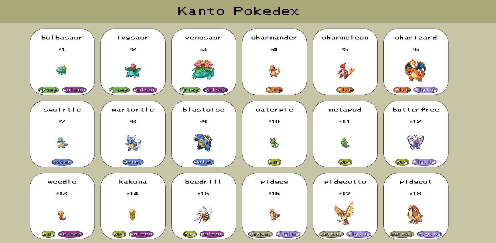

# Kanto-Pokdex
Created a web application to replicate a pokedex on the first generation of Pokemon, using PokeAPI.

## PokeAPI
Pokedex using the [PokeAPI](https://pokeapi.co/) for constructing RESTful API. 
PokeAPI provides a RESTful API interface access data related to Pokémon.

### Author's Note
This is my first web application using any API. Currently have no intention of making this a huge project, but a starting project to apply for my portfolio.

